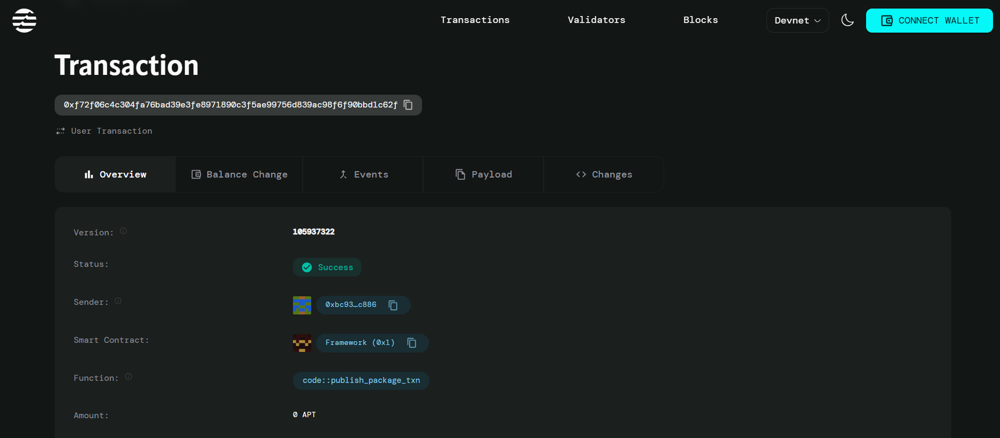

Decentralized MOOC Platform

📄 Project Description
The Decentralized MOOC Platform is a Move smart contract deployed on the Aptos blockchain that enables instructors to create courses and students to enroll in them using AptosCoin. The platform ensures transparency and decentralization in managing course enrollments and payments.

Key Features:

- Instructors can create courses with a specified enrollment fee.
- Students can enroll in courses by paying the fee in AptosCoin.
- Enrollment records are stored on-chain, ensuring transparency.
- Automatic transfer of enrollment fees to the instructor's account.

🌟 Project Vision
The goal of the Decentralized MOOC Platform is to revolutionize online education by leveraging blockchain technology. It aims to:

- Empower instructors to offer courses without intermediaries.
- Provide students with a transparent and trustless enrollment process.
- Foster a decentralized ecosystem for online learning.

🔮 Future Scope
- Add support for course completion certificates.
- Implement refund mechanisms for students.
- Enable course rating and feedback systems.
- Introduce subscription-based course models.
- Integrate with front-end dApps for seamless user interaction.

📜 Contract Details
Module Name: MOOCPlatform

Contract Address: 0xbc93c9b32faa6172550fec69b959f657e42c470b798b6629d2c0ab6ab69ec886

Transaction Hash: 
0xf72f06c4c304fa76bad39e3fe8971890c3f5ae99756d839ac98f6f90bbd1c62f

